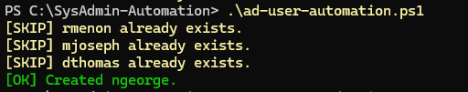
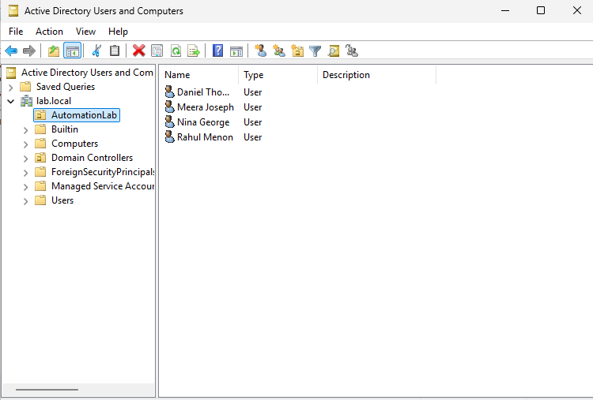

# Active Directory User Automation

## Zusammenfassung (Deutsch)

Dieses Projekt automatisiert die Erstellung von Active-Directory-Benutzern mithilfe von PowerShell und einer CSV-Datei. Das Skript importiert Benutzerdaten, überprüft erforderliche Felder, erkennt bereits vorhandene Konten und erstellt nur neue Benutzer. Zusätzlich werden Fehler kontrolliert behandelt, sodass einzelne fehlerhafte Datensätze den gesamten Prozess nicht unterbrechen.

Ziel war es, typische Aufgaben der Windows-Systemadministration zu automatisieren und dabei Konzepte wie Funktionen, CSV-Import, Eingabevalidierung, Fehlerbehandlung und Active-Directory-Cmdlets praktisch anzuwenden.

---

## Overview

This project demonstrates how PowerShell can automate bulk Active Directory user creation from a CSV file.

The script imports user records, validates required fields, checks for duplicate accounts, creates new users in a dedicated Organizational Unit, and handles unexpected errors without stopping the complete batch process.

The objective was to simulate a realistic administrative workflow in which user data is received from another department and processed automatically.

---

## Technologies Used

- Windows Server 2025
- Active Directory Domain Services
- PowerShell
- ActiveDirectory PowerShell Module
- CSV
- VirtualBox

---

## What I Built

- Created a dedicated `AutomationLab` Organizational Unit
- Imported user information from a CSV file
- Converted each CSV row into a PowerShell object
- Created a reusable `New-LabUser` function
- Validated required user fields
- Checked whether usernames already existed
- Created new Active Directory accounts automatically
- Assigned department information
- Enabled accounts and required password changes at first login
- Added controlled error handling using `try/catch`
- Prevented duplicate user creation

---

## CSV Input Format

The script expects the following columns:

```csv
FirstName,LastName,Username,Department
Rahul,Menon,rmenon,IT
Meera,Joseph,mjoseph,HR
Daniel,Thomas,dthomas,Finance
Nina,George,ngeorge,Marketing 
Invalid,User,,Testing
```

Each CSV row becomes a PowerShell object with properties such as:

```powershell
$User.FirstName
$User.LastName
$User.Username
$User.Department
```

---

## Active Directory Target

Users are created inside:

```text
OU=AutomationLab,DC=lab,DC=local
```

The generated account includes:

- Display name
- Given name
- Surname
- `SamAccountName`
- User Principal Name
- Department
- Temporary password
- Enabled account status
- Password change requirement at first login

---

## Automation Workflow

```text
Import CSV
    ↓
Process one user record
    ↓
Validate required fields
    ↓
Check whether the username already exists
    ↓
Existing account → Skip
New account → Create user
Unexpected failure → Handle error
    ↓
Continue with the next record
```

---

## PowerShell Concepts Practiced

### Functions

A reusable function was created to process one user at a time:

```powershell
function New-LabUser
{
    param(
        $User,
        $Password
    )
}
```

---

### Parameters

The function receives:

- A complete user object
- A SecureString password

This allows the same function to process every row in the CSV.

---

### Import-Csv

```powershell
$Users = Import-Csv -Path $CsvPath
```

Each CSV row is converted into a structured PowerShell object.

---

### foreach Loop

```powershell
foreach ($User in $Users)
{
    New-LabUser -User $User -Password $Password
}
```

The loop passes each imported user object to the function.

---

### Input Validation

```powershell
[string]::IsNullOrWhiteSpace(...)
```

Required fields are checked before contacting Active Directory.

---

### Duplicate Detection

```powershell
Get-ADUser -Filter ...
```

The script searches for an existing `SamAccountName` and skips duplicate accounts.

---

### Error Handling

```powershell
try
{
    ...
}
catch
{
    ...
}
```

`-ErrorAction Stop` ensures Active Directory failures are handled by the `catch` block.

---

### SecureString Password

```powershell
ConvertTo-SecureString
```

The temporary password is converted into the format required by `New-ADUser`.

---

## Result

The script successfully:

- Imported multiple users from CSV
- Created new Active Directory accounts
- Skipped accounts that already existed
- Rejected records with missing required information
- Displayed readable success, skip, and error messages
- Continued processing after individual failures

---

## Sample Console Output

```text
[SKIP] rmenon already exists.
[SKIP] mjoseph already exists.
[SKIP] dthomas already exists.
[OK] Created ngeorge.
```

---

## What I Learned

- How to automate Active Directory administration with PowerShell
- How CSV files can be used as structured input
- How to pass objects into functions
- How to validate user data before processing
- How to prevent duplicate account creation
- How to use `try/catch` for controlled error handling
- How to map CSV values to Active Directory attributes
- How to structure a script into reusable and readable sections

---

## Screenshots

### Script Execution



### Active Directory Users Created



---

## Security Considerations

The current script contains a temporary password directly in the source code because it is designed for an isolated home lab.

In a production environment, passwords should not be stored in plain text. Safer approaches include:

- Prompting securely with `Read-Host -AsSecureString`
- Using a managed secret store
- Applying organization-approved onboarding processes
- Restricting access to scripts and CSV files

---

## Future Improvements

- Generate usernames automatically from first and last names
- Create department-specific Organizational Units
- Add users to department security groups
- Generate structured CSV logs for success, skipped, and failed records
- Add timestamped log files
- Send completion summaries
- Remove hard-coded domain and OU values
- Add stronger parameter validation

---

## Project Context

This project is part of the **Infrastructure Automation Toolkit**, a collection of PowerShell and infrastructure automation projects focused on Windows administration, monitoring, reporting, Active Directory automation, and Linux administration.

### Completed Mini Projects

- System Inventory Automation
- Windows Service Health Monitor
- Active Directory User Automation

### Upcoming Mini Projects

- Disk Space Monitor
- Backup Automation
- Linux Health Monitor
