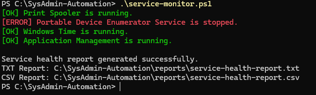
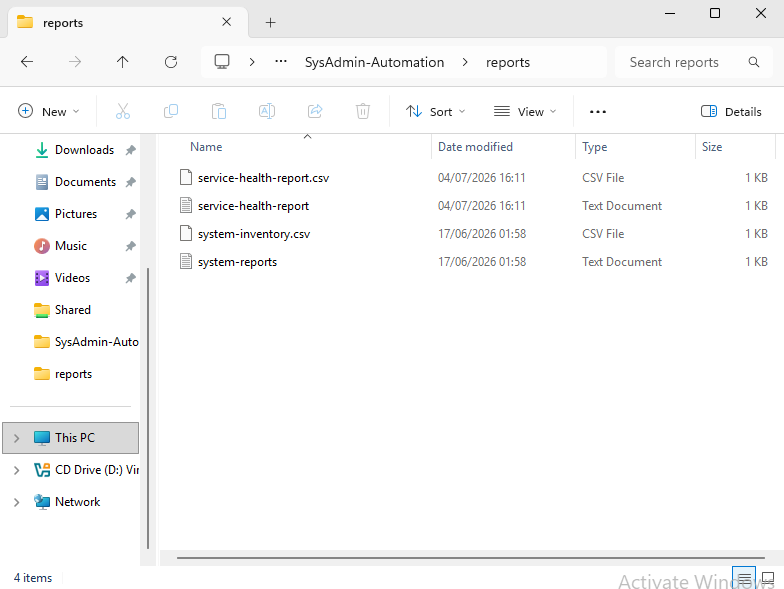

# Windows Service Monitoring Automation

## Zusammenfassung (Deutsch)

Dieses Projekt automatisiert die Überwachung wichtiger Windows-Dienste mithilfe von PowerShell. Das Skript überprüft den Status ausgewählter Dienste, erkennt automatisch laufende oder gestoppte Services und erstellt sowohl einen Textbericht als auch einen CSV-Bericht. Ziel war es, grundlegende Automatisierungskonzepte wie Arrays, Schleifen, Bedingungen und Berichterstellung praktisch anzuwenden.

---

## Overview

This project demonstrates how PowerShell can be used to automate Windows service monitoring.

The script checks the status of selected Windows services, determines whether they are running or stopped, and generates both a human-readable TXT report and a structured CSV report.

The objective of this project was to gain hands-on experience with PowerShell automation concepts commonly used by Windows System Administrators.

---

## Technologies Used

- Windows 11 Pro
- PowerShell
- Windows Services
- PSCustomObject
- CSV Reporting
- TXT Reporting

---

## What I Built

- Monitored multiple Windows services automatically
- Used arrays to store service names
- Used loops to process multiple services
- Used conditions to determine service health
- Counted running and stopped services
- Generated a TXT report
- Generated a CSV report
- Displayed a service health summary

---

## Services Monitored

The current script monitors:

- Print Spooler
- Portable Device Enumerator Service
- Windows Time
- DNS Client

The service list can easily be extended by adding additional service names to the PowerShell array.

---

## PowerShell Concepts Practiced

### Variables

Used variables to store:

- Service names
- Report paths
- Counters
- Dates

---

### Arrays

Stored multiple service names inside an array for automated processing.

Example:

```powershell
$Services = @(
    "Spooler",
    "WPDBusEnum",
    "W32Time",
    "Dnscache"
)
```

---

### foreach Loop

Used a `foreach` loop to process every service without repeating code.

Example:

```powershell
foreach ($ServiceName in $Services)
{
    ...
}
```

---

### if / else Conditions

Checked whether each service was running or stopped.

Example:

```powershell
if ($Service.Status -eq "Running")
{
    ...
}
else
{
    ...
}
```

---

### PSCustomObject

Created structured PowerShell objects for each monitored service before exporting the data to CSV.

---

### Export-Csv

Generated a structured CSV report that can be opened in Excel for further analysis.

---

## Output

The script automatically generates:

```
service-health-report.txt
```

and

```
service-health-report.csv
```

inside the **reports** folder.

The report contains:

- Service Name
- Display Name
- Service Status
- Running/Stopped Summary
- Report Generation Time

---

## Result

The script successfully:

- Checked the status of multiple Windows services
- Identified running and stopped services
- Generated TXT and CSV reports automatically
- Produced a service health summary

---

## What I Learned

- Working with PowerShell arrays
- Understanding foreach loops
- Using conditional statements
- Creating reusable monitoring scripts
- Building PSCustomObjects
- Exporting structured data to CSV
- Automating repetitive administrative tasks

---

## Screenshots

### Script Execution



### Generated Reports



---

## Future Improvements

Possible future enhancements include:

- Monitoring additional Windows services
- Timestamped report filenames
- HTML report generation
- Email notifications
- Scheduled execution using Windows Task Scheduler
- Automatic service restart for critical services

---

## Project Context

This project is part of the **Infrastructure Automation Toolkit**, a collection of PowerShell automation projects focused on Windows administration, monitoring, reporting, Active Directory automation, and infrastructure management.

### Completed Mini Projects

- ✅ System Inventory Automation
- ✅ Windows Service Monitoring

### Upcoming Mini Projects

- Active Directory User Automation
- Disk Space Monitoring
- Backup Automation
- Linux Health Monitoring

