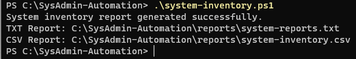
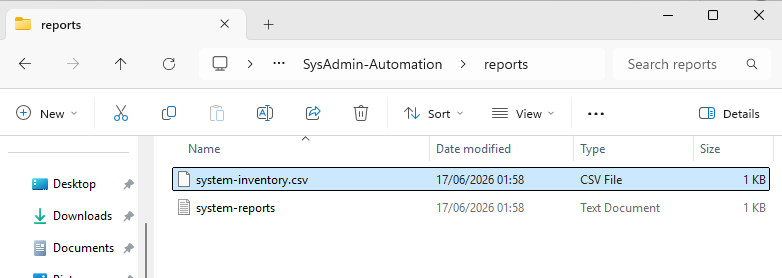

# System Inventory Automation

## Zusammenfassung (Deutsch)

Dieses Projekt automatisiert die Erfassung grundlegender Systeminformationen eines Windows-Clients mithilfe von PowerShell. Das Skript sammelt Informationen zum Betriebssystem, Netzwerk, Arbeitsspeicher und Speicherplatz und erstellt daraus sowohl einen Textbericht als auch eine CSV-Datei. Ziel war es, grundlegende Automatisierungsaufgaben im Bereich Systemadministration kennenzulernen und strukturierte Reports automatisch zu erzeugen.

---

## Overview

This project demonstrates basic IT infrastructure automation using PowerShell. The script collects important system information from a Windows machine and automatically generates both a human-readable text report and a structured CSV report.

The goal was to gain hands-on experience with PowerShell scripting, system administration tasks, reporting, and automation.

---

## Technologies Used

* PowerShell
* Windows 11 Pro
* CIM / WMI Classes
* CSV Reporting
* Windows Networking
* File System Management

---

## What I Built

* Collected operating system information
* Retrieved computer manufacturer and model
* Retrieved total installed RAM
* Retrieved IPv4 network configuration
* Retrieved disk usage statistics
* Generated a TXT report
* Generated a CSV report
* Created a reusable PowerShell automation script

---

## Information Collected

### System Information

* Computer Name
* Current User
* Operating System
* OS Version
* Manufacturer
* Model
* Total RAM

### Network Information

* IPv4 Address

### Storage Information

* Drive Letter
* Used Space
* Free Space
* Disk Usage Percentage

---

## Sample Output

The script generates:

```text
system-report.txt
```

and

```text
system-inventory.csv
```

inside the reports directory.

---

## PowerShell Concepts Practiced

### Variables

```powershell
$ComputerName
$OS
$Drive
```

Used to store system information for later processing.

### CIM Queries

```powershell
Get-CimInstance Win32_OperatingSystem
```

Used to retrieve information directly from Windows Management Instrumentation (WMI).

### Objects

```powershell
[PSCustomObject]
```

Used to create structured data that can be exported to CSV.

### Pipelines

```powershell
$Inventory | Export-Csv
```

Used to pass data between PowerShell commands.

### File Operations

```powershell
Add-Content
Export-Csv
```

Used to create reports automatically.

---

## Result

The automation script successfully:

* Collected system information
* Generated a structured TXT report
* Generated a structured CSV report
* Reduced manual system inventory tasks

---

## What I Learned

* PowerShell variables and objects
* Using CIM classes to retrieve system information
* Working with PowerShell pipelines
* Creating reusable automation scripts
* Exporting structured data to CSV
* Generating automated reports

---

## Screenshots

### Script Execution



### Generated Reports



---

## Next Improvements

* Monitor Windows services automatically
* Generate HTML reports
* Add event log collection
* Export reports with timestamps
* Schedule automated execution using Task Scheduler

---

## Project Context

This project is part of the **Infrastructure Automation Toolkit**, a collection of PowerShell and infrastructure automation projects focused on Windows administration, Active Directory, monitoring, reporting, and automation.
